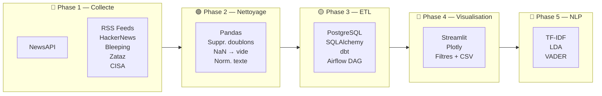

# CyberPulse — Veille automatique & analyse NLP des actualités cyber

## Problématique
Comment automatiser la veille cyber et détecter les sujets émergents
avant qu'ils deviennent des crises ?

## Utilisateur cible
Analystes SOC, consultants cybersécurité, DSI — toute personne qui
surveille les menaces sans vouloir lire 50 sites par jour et 
tout passionné s'intéressant à l'actualité cyber...

## KPIs principaux
- **K1** — Nombre d'articles collectés par jour / par source
- **K2** — Top 10 mots-clés les plus fréquents (7 jours glissants)
- **K3** — Répartition des articles par type de menace

## Architecture technique
Extract → Transform → Load → Visualize

| Phase | Outils |
|---|---|
| Acquisition | Python · Requests · BeautifulSoup · NewsAPI · PRAW |
| Nettoyage | Python · Pandas |
| ETL & Stockage | Airflow · PostgreSQL · SQLAlchemy · dbt |
| Visualisation | Streamlit · Plotly |
| NLP (bonus S5) | Scikit-learn · TF-IDF · LDA · VADER |


## Pipeline — Architecture technique


## Structure du projet
```
cyberpulse/
├── data/          # raw/ et cleaned/
├── src/           # scripts Python
├── app/           # application Streamlit
├── db/            # SQL et ETL
├── notebooks/     # exploration
├── pipelines/     # DAGs Airflow
└── README.md
```

## Lancement (à compléter plus tard...)
```bash
pip install -r requirements.txt
streamlit run app/app.py
```

## Période de construction du projet à la Wild code School :
10 mars → 23 avril 2026 · Projet solo · Formation Data Analyst

